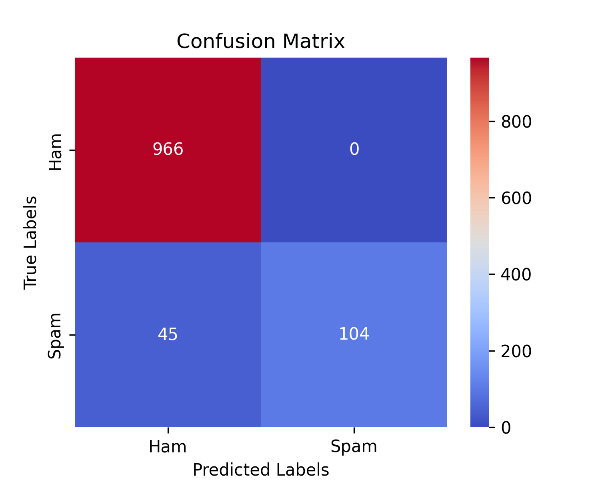

## Overview

Simple Machine Learning Project that classifies SMS messages as **Spam** or **Ham**. The dataset used for this project is [UCI SMS Spam Collection](https://archive.ics.uci.edu/dataset/228/sms+spam+collection) public dataset.

## Features 
- Data preprocessing (includes: cleaning text from stopwords and tokenization)
- Implemented TF-IDF vectorization to transform SMS messages into numerical features.
- Model trained using Logistic Regression algorithm
- Model evaluation includes: accuracy, precision, recall and F1-score metrics
- Graphical visualization of **feature importance** and **confusion matrix** 
- Implemented simple predict function that predicts whether a given SMS message is ham or spam
## :file_folder: Project Structure 
In the *dataset* folder you will find the original UCI SMS Spam Collection dataset. Models are saved using joblib library in the *models* folder and jupyter notebooks used for data analysis are saved in the *notebooks* folder.
Training and prediction features are separeted. You can first train the model running train.py, that will compute the evaluation metrics as well, and then classify a given SMS running main.py.

### Graphical Visualizations

